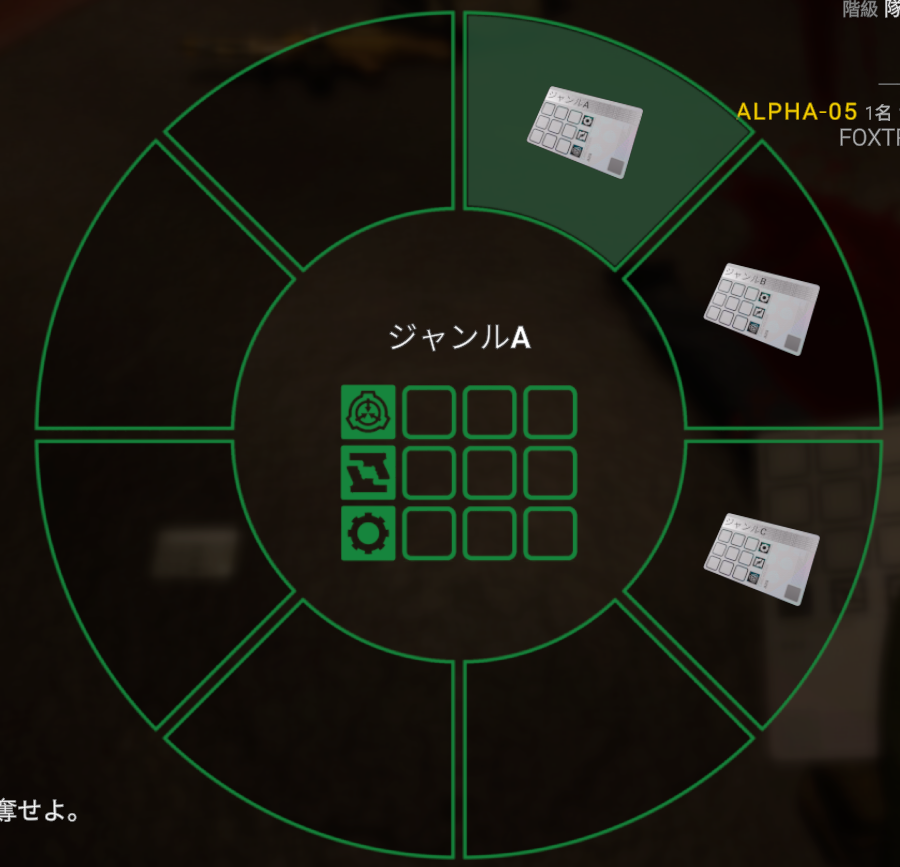

# シャープ鯖 - v2.0.0.0 草案
- [部隊システム](#部隊システム)
- [コミュニケーション改善](#コミュニケーション改善)
- [ロール/アイテムの再設計](#ロールアイテムの変更)
- [マップリワーク](#マップリワーク)
# 部隊システム
まずゲームには新たにForceという大きな枠組みのシステムが導入されます。これらは基本的に機動部隊に適用されます。 
Force(部隊)システムでは、以下の新たな概念が追加されます。   
- 部隊内の明確な階級システム
- 本隊/分隊
- 隊の昇格/合流
- 部隊内階級の昇進
- 貢献度システム
- 派生システム

これらはゲーム内に自然に組み込まれ、無視してもなんら影響がないように設計されます。それぞれ以下のような内容です：
## 階級システム
部隊内の階級は以前まではとてもあやふやでしたが、現在は主に４つの階級に分けられるようになりました。
- TopLead - 隊長級で本隊を率いることが可能です
- SubLead - 軍曹/補佐官級で分隊編成時バフを強化します
- Member - 部隊を構成する一般的な隊員です。
- Alone - 部隊から外れて行動しており、なおかつ近くに他のAlone階級がおらず分隊を編成できないときになります。(なおAloneはTopLead/SubLeadの階級状態には影響せず、TopLeadは例え一人でも常に本隊を形成します。)
## 本隊/分隊
機動部隊などは最初は隊長クラスのロールをTopLeadとした一つの本隊から始まります。
隊に所属している隊員は小さな特定の効果を受け取ることができます。現在案として以下のような効果があります：
- TopLeadまでの距離表示
- 移動速度上昇
- 攻撃力上昇
- etc

これらは所属部隊内の隊員の合計数によって強さや効果数が変動します。

さて、しかし施設内を探索するにつれて部隊が分かれることもあるでしょう。そんなときには分隊システムの登場です。
分隊は隊員の階級に関係なく、本隊から一定距離以上離れており、なおかつ2人以上のAloneが共に行動しているときに自動的に形成されます。
分隊には本隊よりは弱いですが、それでも同じような効果を全隊員は得ることができます。これらの効果はSubLead階級が分隊に所属したときに強化されます。
## 隊の昇格/合流
もし分隊がいくつか存在していて、本隊が崩壊したとしましょう。そしたら誰が部隊全体を率いるのでしょうか？それは一番貢献しているナウでヤングな分隊であるべきでしょう。

それが隊の昇格システムです。Subleadを有する分隊ごとの貢献したスポーンウェーブポイントを比較し、一番貢献していた分隊を選んだらその分隊内で一番貢献していたSublead隊員をTopLeadに昇格させ分隊は本隊へと昇格します。
もしどこもSubleadを有していなかった場合は現時点で一番貢献していた分隊の一番貢献していたMemberをTopLeadに昇格させます。

また、本隊が分隊に合流し、一分間行動を共にしていた場合分隊は解散され、本隊へと吸収されます。その際分隊内でSubleadだった隊員は合流後もSubleadとして活動が可能です。
## 部隊内階級の昇進
もし本隊でTopLeadが死んだらどうすべきでしょうか？そうです、新しいTopLeadに部隊を指揮させる必要があります。

すべての本隊内のSubLead階級はTopLeadが死亡したときに貢献度を比較してTopLeadに昇格する機会があります。ですが、ここのTopLeadの選出には少し特殊なシステムがあります。
それは役職による優先です。例えば通常本隊はスポーン時、機動部隊の隊長/軍曹/二等兵などの編成ですが、まれに元帥など特殊な上位階級の役職がスポーンするときがあります。そのときは元帥がTopLeadとなり、隊長級はSubLeadとして扱われますが
TopLeadが死亡したとき、彼らはSubLeadの貢献度を無視し優先的にTopLeadに昇格することが可能です。これは隊の昇格システムにも適用され、一番貢献度が高い分隊よりも隊長役職を有する分隊が本隊になることができます。

また、すべての本隊/分隊内のMemberは隊全体の貢献度の中での内訳の70%を一分間保持するとSubLead階級に昇進することが可能です。
また、隊の昇格に関する特殊な昇進方法として、隊の昇格時にTopLeadに昇格したメンバーの次に貢献していたメンバーは条件が緩和され、今後内訳の60%を40秒間保持することでSublead階級に昇進することができるようになるというものもあります。
## 貢献度システム
部隊の貢献度には、もちろんSL標準の貢献度の機会も用いますが、その他にも以下の観点から独自に貢献度を定期的に評価して運用する予定です。
影響は主に以下の数値変更をもたらします：
- 影響：大 - 10点
- 影響：中 - 5点
- 影響：小 - 1点
### [加点対象]
- 分隊/本隊での継続所属時間(影響：大)
- 継続的な隊内外に対してのコミュニケーション(影響：小, ただし、スパム的な方法はカウントされません)
### [減点対象]
- 非武装の敵陣営に対する即射殺(影響：中)
- 意図的なFF(影響：大, 敵が付近に存在しなく、部隊内の全部隊の40%が集まっている場所でのFF, SCP-018の使用)
- SCP-914でのキーカードの使用(影響：小)

これらは基本的に小規模な影響を与えますが、それでもチケットやスポーンに関連するため重要な要素であると言えるでしょう。
## 派生システム
上で述べた部隊システムは基本的に機動部隊で運用されますが、これらに準じて派生した独自システムを各陣営・個別部隊が有している場合があります。
それらの主な違いは部隊の呼称の仕方などもありますが、大きいのは貢献度システムの違いでしょう。

例えばDクラス職員の場合、ギャングという小規模なシステムがあり、キーカードを拾ったり、914をいじりまくったりなど悪名高いことをしていくことで貢献度を稼ぐことが可能で継続所属時間の影響が小に抑えられ、
カオス・インサージェンシーの場合はSCP-914の使用が減点対象から外れ、また、継続所属時間の影響が中に抑えられています。

GoCや第五教会などのその他の陣営についてやこれらの派生システムの詳細に関しては後ほど決定する予定です。

# コミュニケーション改善
現状のRPにおいてVCの存在はとても重要で大きな要素です。ですが、このままだとVCが使えないけどRPがしたい人たちが少し不憫であると言えるでしょう。
そこで新たに追加するのがInventoryChatシステムです。このシステムでは、インベントリを用いた直感的な定型文チャットを周囲や無線に送ることが可能です。

以下がイメージ画像です。

この機能に追加するジャンルや定型文は現在募集中です。是非ご提案ください！

# ロール/アイテムの変更
現状のシャープ鯖のロールやアイテムはあまりにも混沌に満ちています。何がなんだかよくわからず、存在にすら触れられないアイテムが多々あることでしょう。  
そこで行うのが大規模なロール/アイテムやスポーンシステムの変更です。以前までのカスタムアイテムといえば、ロールスポーン時に渡される専用アイテムにしかほとんど目が向けられていませんでした。  
そこで、もっと幅広いカスタムアイテムを使ってもらうために以下の方針を採用することにしました。
## [アイテム方針 構想]
- 幅広いアイテム／武器の選択肢を与える
- - 現状施設の中においてある武器やら特殊なアイテムにわざわざ目を向けなくともスポーン時のアイテムでどうにかなってしまうことが多いため、
    初期配布アイテムの弱体化を行います
- - 施設内に幅広い種類の武器・アイテムを設置し、更にプレイヤーが興味を引くようゲーム内ロッカーなどに自然に組み込んだり、アイテム専用の部屋・ロッカーを作成します。
- OPを作らない
- - シュバルツシルトクェイサァー？となるようなプレイヤーは当然のように多いので、知っている人間だけが無双できるようなアイテムを作りません。

さて、ロールの変更についてですがこれもまた重要です。機動部隊、例えばE-11を例に上げてみましょう。  
彼らは確かにSCPを破壊することができますが、だからといって銃器だけ持って財団施設に飛び込むのはおかしいですよね？そこで、SCPやGOIに対抗する為のアイテムを導入します。いかが計画している物の一部です。
## [新E-11 アイテム構想]
- 回復ホルダー
- - 回復アイテムを追加で3つ銃弾スロットを用いて保存することができます。
- 簡易バリケード
- - 攻撃を防いだり、通行を妨げるバリケードです。しばらくインタラクトすることで撤去できます。
- 収容キーカード
- - 各SCPに対する特攻アイテムを施設内で解錠できる使い切りのキーカードです。

また、アイテム以外にもロールの編成を見直します。例えば苦労して脱出した科学者が得るものがNTFに特殊な銃がついただけというのは、なんだかおかしいですよね？  
科学者はあくまでSCPの扱いや科学のスペシャリストだというのに、急に大きな銃を渡されるだけというのは少々奇妙です。そこで、部隊を以下のようにします。
## [新E-11 役職構想]
- 元帥
- 隊長
- 軍曹
- 補佐官
- 医療スペシャリスト / 戦闘スペシャリスト / 収容スペシャリスト
- 二等兵
このような、自然な部隊構成を元にした再構成を全部隊に対して行うことを計画しています。

## SCPのリワーク
こちらに関しては完全にまだ構想段階なのですが、今の所全SCPの配置の見直し、SCP-966/682の作り直し等を計画しています。今後大方定まったら通知します！

# マップリワーク
ええっと、皆さんもうこれに関する問題についてはご存知ですよね？さあ、本題です。  
かねてよりシャープ鯖には様々なカスタムマップが散りばめられ、あまり人々に認識されず使われていないと言った問題が議論されてきました。
それを解決するために、一度マップ全体をスクラップにし、見直しをした再構成・再構築をすることを決定しました。どのように再構築するかは、以下の方針を計画しています。
- 意味を持った部屋
- - アイテム、ロッカーなどプレイヤーが実際プレイ中に求めるような戦闘においてアドバンテージを得られる探索要素をもたせます。
- ゲームプレイに自然に組み込まれた空間・部屋
- - プレイヤーが通る道筋に自然に組み込まれるような、現在のサーバールームなどのようなタイプの部屋を重視します。
- Site-02に適応した空間
- - 以前までは人部屋をまるごとひとつのカスタム空間に置き換えたり、単純な小さなサブレベルを無限にはやしまくったりしていましたが
    それは果たしてSite-02という施設の構造を意識しているでしょうか？このリワークでは、Site-02というバニラのマップを尊重し、その上に自然に組み込まれるようなマップを意識します。
現在新たなカスタムマップの初期案として以下のものを構想しています。是非要望があればご提案ください！
## [追加]
- 新たなカーブ、十字路等既存のマップの上に新たな分岐経路を生み出す部屋
- 上層サーバー
- 上層会議室
- Dr. Lなど博士の部屋などを含んだ廊下のカスタムマップを用いた再現・なめらかな拡張
- メンテナンストンネル
- 医務室
- 上層トイレ
- 中層休憩室
- 下層資料室
- 下層Dクラス収容房警備員室
- 下層研究室
- SCP-3114/SCP-035/SCP-966/SCP-999/SCP-076収容室
## [変更]
- 地上
- - 内容：微調整
- 上層武器庫
- - 内容：再配置・再構築
- SCP-3005収容室
- - 内容：再配置・再構築
## [削除]
- 通信室
- - 理由：存在意義がないため。放送室で十分
- 上層職員オフィス(PersonnelOfficeZone)
- - 理由：あまりにも肥大化しているが、アクセスする意味が薄くあまり利用されていない。
- - こちらはマップ内に含まれる構造物やアイデアを再利用し再構成することを目指しています。
- 中層トイレ
- - 理由：中層休憩室への統合
- 焼却炉管制室
- - 理由：単純に邪魔
- カオスの隠れ家
- - 理由：流石に隠れ家まで作られるほどザルではない...はず。
- ほとんどのパスコード扉
- - 理由：パスコードがあまり使われず吹き飛ばされたりすることが大半なので廃止
以上がマップリワークの初期構想となります。今後内容が大きく変更される可能性はありますが、ひとまずここまで。

# 草案について
本草案はできる限りの改善を繰り返し、v2.0.0.0を素晴らしいアップデートにすることを目指しています。  
是非、様々な意見や要望を投げつけて改善にご協力ください！